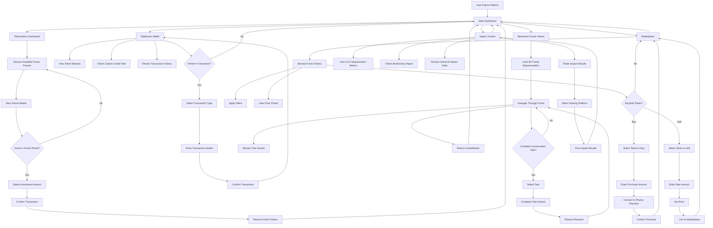

# Carbon Forest: RWA-Backed Stablecoin & Tokenized Forest Marketplace

A blockchain platform that enables users to invest in tokenized forest land that generates carbon credits, with a yield-bearing stablecoin pegged to carbon credit values and an interactive metaverse component.

## Key Features

- **Tokenization Dashboard**: Interface showing available forest parcels for investment, with real-time data on carbon sequestration potential and expected yields
- **Stablecoin Wallet**: Displays user's token balance, accumulated yield from carbon credits, and transaction history
- **Metaverse Forest Viewer**: 3D interactive representation of owned forest plots where users can monitor growth and complete conservation tasks
- **Marketplace**: Trading platform for buying/selling forest tokens with price charts, filtering options, and integration with the Pharos payment system
- **Sustainability**: Visual dashboard showing environmental impact metrics (CO2 sequestered, biodiversity supported) from user investments

## Project Architecture



## Technology Stack

- **Frontend**: React with TypeScript
- **UI Components**: ShadCN UI
- **Styling**: Tailwind CSS
- **Visualization**: Recharts for data visualization
- **3D Rendering**: (To be implemented for Metaverse Forest Viewer)

## Getting Started

```bash
# Install dependencies
npm install

# Run development server
npm run dev
```

## Project Structure

The application is organized into several main components:

- **Dashboard**: Main entry point with overview and navigation
- **Tokenization**: Components for browsing and investing in forest parcels
- **Wallet**: Components for managing stablecoin and transactions
- **Metaverse**: Components for 3D forest visualization and interaction
- **Marketplace**: Components for trading forest tokens
- **Impact**: Components for tracking and sharing environmental impact

